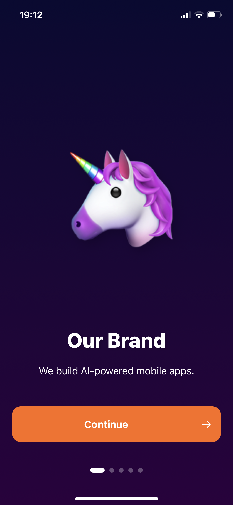
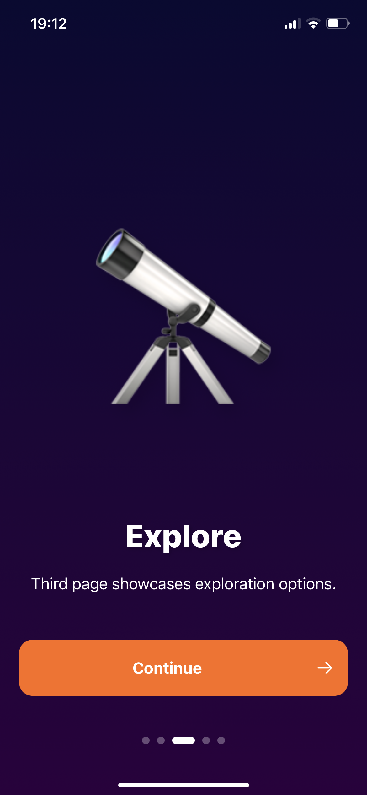
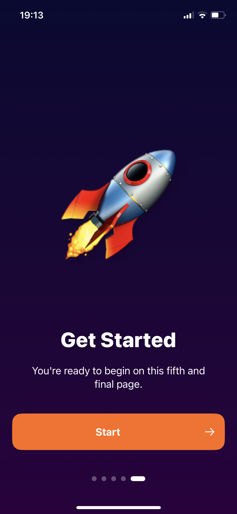

# AFOnboarding

<p align="left">
<a href="https://www.swift.org"></a>
<a href="https://developer.apple.com/ios/"></a>
<a href="https://developer.apple.com/documentation/SwiftUI"></a>
<a href="https://en.wikipedia.org/wiki/MIT_License/"></a>
</p>

**`AFOnboarding`** is a SwiftUI-based iOS app that provides an engaging onboarding experience.

# Getting Started

### Requirements

- iOS 15.0+
- Xcode 13.0+
- Swift 5.5+

### Installation

1. Clone the repository:
``` bash
git clone https://github.com/gurelyusuf/AF-Onboarding.git
```

## Screenshots

<div style="display: flex; justify-content: space-between;">
  
  
  
</div>

### Feedback

If you have any feedback, please reach out to my [email](mailto:yusufgureldev@gmail.com)

### License

This project is licensed under the [MIT License](https://choosealicense.com/licenses/mit/)